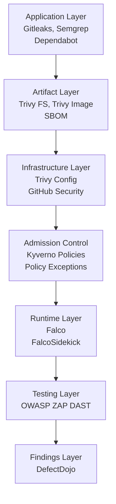
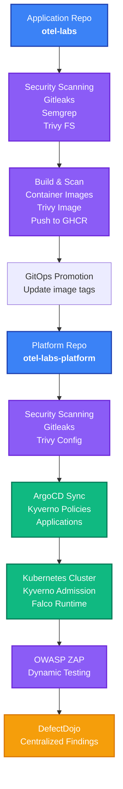
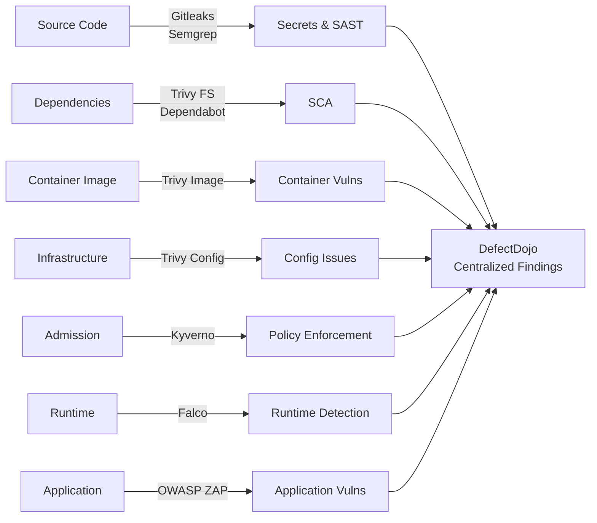
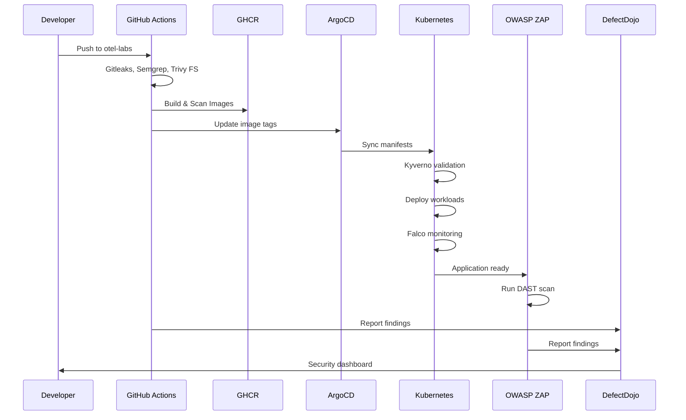
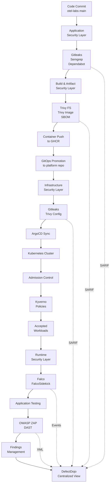

## Kubernetes DevSecOps – End-to-End Security from Code to Runtime




### Complete DevSecOps implementation spanning application code, container images, infrastructure, Kubernetes policies, runtime detection, and dynamic application testing.

This project demonstrates security controls integrated throughout the software delivery lifecycle rather than treated as a final security check.

The implementation uses **OTel Labs** as the instrumented application and **OTel Labs Platform** for infrastructure, Kubernetes, CI/CD, and security controls.

Builds on the [OTel on EKS](/projects/k8s-otel-proj/) infrastructure foundation.

## Security Layers

Security is implemented across seven distinct layers:



## Architecture



## Scanning & Detection



## Repositories

**Application Repository:** [ otel-labs](https://github.com/sagarkpanda/otel-labs)
* Source code for Node.js, Python, and Go services
* Application security scanning (Gitleaks, Semgrep, Trivy)
* Container image builds and publishing to GHCR

**Platform Repository:** [ otel-labs-platform](https://github.com/sagarkpanda/otel-labs-platform)
* Terraform infrastructure (EKS, VPC, networking)
* Kubernetes manifests and ArgoCD applications
* Kyverno security policies and exceptions
* Infrastructure and configuration scanning
* OWASP ZAP DAST configuration

## Components

### Application Layer Security

| Tool | Purpose |
|------|---------|
| **Gitleaks** | Secret detection in code and Git history |
| **Semgrep** | SAST — insecure coding patterns |
| **Dependabot** | Automated dependency updates |

### Artifact & Infrastructure Layer

| Tool | Purpose |
|------|---------|
| **Trivy FS** | SCA — dependency vulnerability scanning |
| **Trivy Image** | Container image vulnerability scanning |
| **Trivy Config** | Terraform and Kubernetes configuration scanning |

### Kubernetes & Runtime Layer

| Tool | Purpose |
|------|---------|
| **Kyverno** | Admission control and security policy enforcement |
| **Falco** | Runtime behavior detection and alerting |
| **OWASP ZAP** | Dynamic application security testing |

### Findings Management

| Tool | Purpose |
|------|---------|
| **GitHub Security** | Centralized SARIF findings in GitHub |
| **DefectDojo** | Centralized vulnerability management across all scanners |

## Key Features

✅ **Application Security** — Gitleaks, Semgrep, Trivy scanning across multiple languages (Node.js, Python, Go)

✅ **Infrastructure as Code Scanning** — Terraform and Kubernetes manifest validation

✅ **Kubernetes Admission Control** — Kyverno policies enforcing image tags, resource limits, trusted registries

✅ **Policy Exceptions** — Scoped exceptions for legitimate platform workloads

✅ **Runtime Security** — Falco detecting suspicious process execution and file access

✅ **Dynamic Testing** — OWASP ZAP scanning deployed applications

✅ **Centralized Findings** — DefectDojo aggregating results from all security tools

✅ **GitOps Integration** — Security scanning triggered by GitHub Actions, results fed to DefectDojo

## Workflow



## Deployment

### Prerequisites

* AWS account with EKS permissions
* kubectl configured
* GitHub repositories set up
* DefectDojo instance (local or cloud)

### Bootstrap

Provision the infrastructure:

```bash
cd terraform
terraform init
terraform plan
terraform apply
```

The bootstrap script automatically installs:
* ArgoCD
* Kyverno
* Falco

### Configure Security Workflows

Set GitHub Actions secrets in both repositories:

```text
DEFECTDOJO_URL
DEFECTDOJO_API_KEY
```

### Deploy Applications

Applications deploy via ArgoCD using the GitOps pattern:

```bash
kubectl apply -f k8s/argo-apps/root-app.yml
```

Or individually:

```bash
kubectl apply -f k8s/argo-apps/kyverno-policy.yml
kubectl apply -f k8s/argo-apps/traefik-app.yml
kubectl apply -f k8s/argo-apps/node-frontend-app.yml
# ... etc
```

## End-to-End Flow



## Blog Post

For a detailed walkthrough of the complete implementation, architecture decisions, and hands-on examples, see:

[**End-to-End DevSecOps on EKS: Code, Containers, Kubernetes & Runtime Security**](/blogs/devsecops/)

The blog covers:
* Application security scanning (Gitleaks, Semgrep, Trivy)
* Infrastructure scanning (Trivy Config)
* Kyverno concepts and policy enforcement
* Falco runtime detection with practical examples
* OWASP ZAP dynamic testing
* DefectDojo centralized findings management
* End-to-end deployment and setup

## Implementation Status


### Completed

* ✅ Gitleaks secret scanning (application + platform repos)
* ✅ Semgrep SAST analysis
* ✅ Dependabot dependency updates
* ✅ Trivy filesystem scanning (SCA)
* ✅ Trivy container image scanning
* ✅ Trivy configuration scanning (Terraform + Kubernetes)
* ✅ GitHub Security integration (SARIF uploads)
* ✅ DefectDojo centralized findings management
* ✅ Kyverno admission policies (image tags, resource limits, trusted registries)
* ✅ Kyverno policy exceptions (scoped exemptions)
* ✅ Falco runtime security with FalcoSidekick
* ✅ OWASP ZAP DAST integration
* ✅ End-to-end workflow validation
* ✅ Comprehensive blog documentation

## Related Projects

[**Infrastructure foundation and observability setup: OTel on EKS**](/projects/k8s-otel-proj/)
