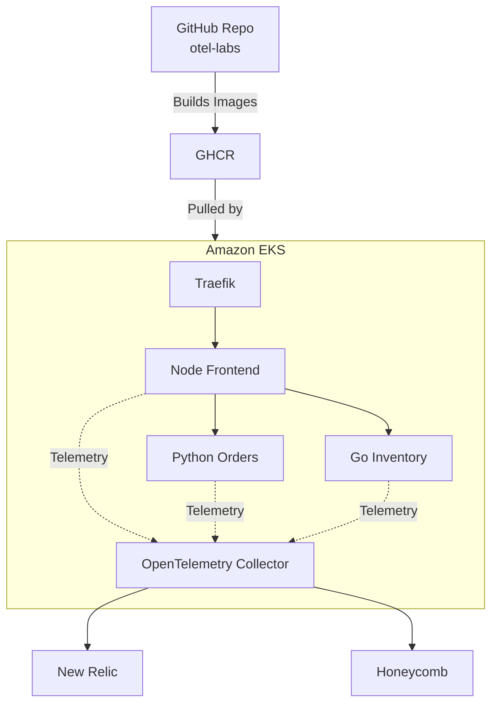
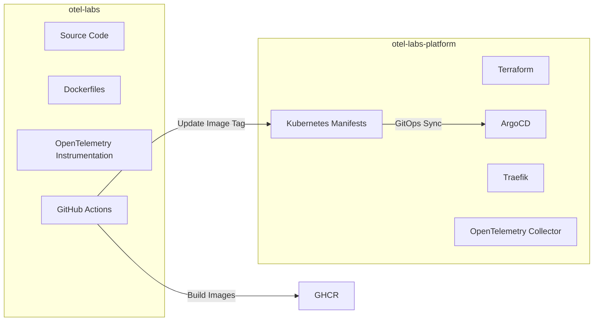

## OTel Labs Platform – OpenTelemetry on EKS: End-to-End Observability


### Infrastructure and GitOps platform for the **otel-labs** OpenTelemetry demo application.

The repository provisions an Amazon EKS cluster using Terraform and deploys platform components such as ArgoCD, Traefik, OpenTelemetry Collector, and Kubernetes observability tooling using GitOps.

The companion application repository is: [ otel-labs](https://github.com/sagarkpanda/otel-labs)

`otel-labs` contains the instrumented applications:

* Node Frontend
* Python Orders API
* Go Inventory API

Container images built from `otel-labs` are consumed and deployed by this repository.


## Architecture



## Components

### Infrastructure

Provisioned using Terraform:

* VPC
* Public Subnets
* Amazon EKS
* Managed Node Group
* EKS Addons

### GitOps

Managed using ArgoCD:

* Traefik
* OpenTelemetry Collector
* kube-state-metrics
* Node Frontend
* Python Orders
* Go Inventory

### Observability

OpenTelemetry Collector receives:

* Metrics
* Logs
* Traces

and exports telemetry to:

* New Relic
* Honeycomb

The collector also gathers Kubernetes telemetry using:

* kubeletstats
* k8s_cluster
* kube-state-metrics

## Repository Structure

```text
.
├── terraform/
│   ├── eks.tf
│   ├── nodegroup.tf
│   ├── addons.tf
│   ├── bootstrap.sh
│   └── ...
│
└── k8s/
    ├── argo-apps/
    ├── node-frontend/
    ├── python-orders/
    ├── go-inventory/
    ├── otel-collector/
    └── kustomization.yml
```

## Relationship with otel-labs

This repository manages the platform.

The application repository manages the workloads.



When a new image is built from `otel-labs`, ArgoCD can deploy the updated image into the Kubernetes cluster managed by this repository.

## Cluster Bootstrap

Provision the cluster:

```bash
cd terraform

terraform init

terraform plan

terraform apply
```

Terraform creates:

* VPC
* EKS Cluster
* Managed Node Group
* EKS Addons

After the infrastructure is ready, the bootstrap script installs ArgoCD and applies required Kubernetes resources.

```text
Terraform Apply
       │
       ▼
Amazon EKS
       │
       ▼
bootstrap.sh
       │
       ├── Update kubeconfig
       ├── Install ArgoCD
       ├── Create Namespaces
       └── Apply Secrets
```
> If you want, you can use kubectl apply -f root_apps.yaml in the bootstartp so the workload is also created automatically

## Deploying ArgoCD Applications

The repository supports three deployment approaches.

### Option 1: Individual Applications

Create each ArgoCD Application separately.

```bash
kubectl apply -f k8s/argo-apps/traefik-app.yml

kubectl apply -f k8s/argo-apps/kube-state-metrics-app.yml

kubectl apply -f k8s/argo-apps/otel-collector-app.yml

kubectl apply -f k8s/argo-apps/node-frontend-app.yml

kubectl apply -f k8s/argo-apps/python-orders-app.yml

kubectl apply -f k8s/argo-apps/go-inventory-app.yml
```

### Option 2: Root Application (App of Apps)

A single parent application creates all child applications.

```text
Root Application
      │
      ├── Traefik
      ├── kube-state-metrics
      ├── OpenTelemetry Collector
      ├── Node Frontend
      ├── Python Orders
      └── Go Inventory
```

This is the classic ArgoCD App of Apps pattern.


### Option 3: Kustomize Bootstrap

Apply the root Kustomization.

```bash
kubectl apply -k k8s
```

```text
k8s/
│
├── argo-apps/
│   ├── *.yml
│
└── kustomization.yml
```

This creates all ArgoCD Applications in a single command.


## Accessing ArgoCD

Port-forward locally:

```bash
kubectl port-forward svc/argocd-server -n argocd 8080:80
```

Or access through the configured Traefik ingress by applying the ingress

```bash
kubectl apply -fk8s/infra/argo/argo-ingress.yml
```

## Kubernetes Observability

The OpenTelemetry Collector gathers cluster telemetry from multiple sources.

```text
kubeletstats
      │
      ├── Node Metrics
      ├── Pod Metrics
      └── Container Metrics

k8s_cluster
      │
      ├── Cluster State
      └── Kubernetes Events

kube-state-metrics
      │
      ├── Deployments
      ├── StatefulSets
      ├── Services
      └── Replica Status
```

This telemetry is exported together with application telemetry to both observability backends.

Integrate Honeycomb MCP server with  [***Claude***](/blogs/monitoring/otel-on-eks/#ask-claude) to and ask questions in natural language about cluster and applications. Honecomb canvas also has the same AI capabilities.