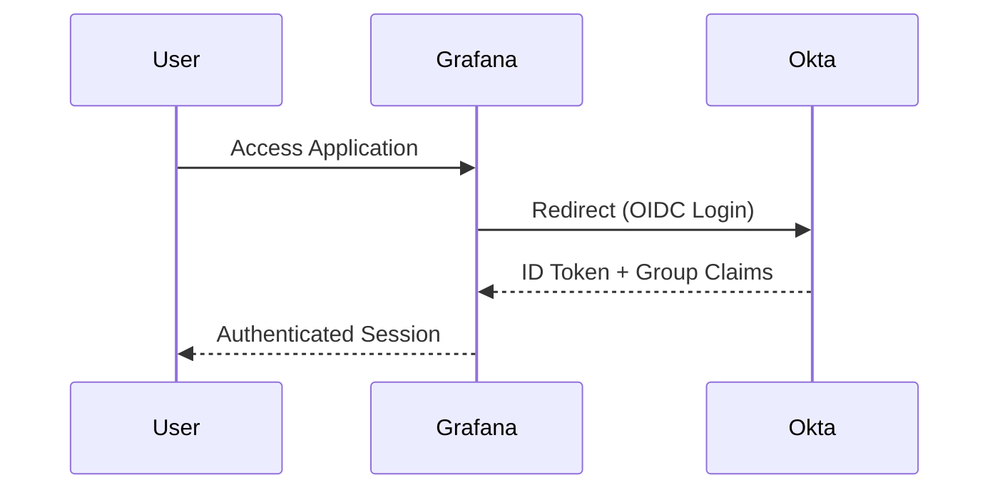

## Enterprise SSO Identity Stack

### Production-style Identity and Access Management using LDAP, OpenID Connect, Keycloak and Okta

This project demonstrates how modern applications implement **Single Sign-On (SSO)** using open standards rather than vendor-specific integrations.

Beginning with a centralized LDAP directory, the lab federates identities into **Keycloak**, configures **Okta** as a second independent Identity Provider, and secures **Grafana** using **OpenID Connect (OIDC)** with group-based authorization.

Rather than focusing on a single product, the project illustrates how directory services, identity providers, authentication protocols, and applications work together to form a complete Identity and Access Management (IAM) architecture.

The complete implementation is documented in the accompanying blog post.

## Architecture

```mermaid
flowchart LR

    U([User])

    C[Caddy]

    G[Grafana]
    PLA[phpLDAPadmin]

    K[Keycloak]
    O[Okta]

    L[(OpenLDAP)]

    U -->|HTTPS| C

    C -->|HTTPS| G
    C -->|HTTPS| PLA

    G -->|OIDC| K
    G -->|OIDC| O

    K -->|LDAP Federation| L

    PLA -->|Manage Users & Groups| L
  ```

The project demonstrates two independent authentication paths for the same application:

- **OpenLDAP → Keycloak → Grafana**
- **Okta Universal Directory → Grafana**

Both providers authenticate users via **OpenID Connect (OIDC)**, allowing Grafana to rely on standards rather than vendor-specific integrations.

---

## Components

### Directory Layer

**OpenLDAP** serves as the centralized directory storing users, groups, and directory objects.

Directory administration is performed through **phpLDAPadmin**, while Keycloak federates identities directly from LDAP without duplicating user credentials.

### Identity Providers

The project demonstrates two approaches to Identity and Access Management.

#### Keycloak

- LDAP Federation
- User Synchronization
- OpenID Connect (OIDC)
- Group Mapping
- Token Claims

#### Okta

- Universal Directory
- Users & Groups
- OpenID Connect (OIDC)
- Group Claims
- Enterprise Single Sign-On

Grafana is configured to trust **both Identity Providers**, demonstrating how modern applications authenticate users through standard protocols regardless of where identities are managed.

---

## Authentication Flows

### OpenLDAP → Keycloak → Grafana

```mermaid
sequenceDiagram

    participant User
    participant Grafana
    participant Keycloak
    participant LDAP

    User->>Grafana: Access Application
    Grafana->>Keycloak: Redirect (OIDC Login)
    Keycloak->>LDAP: Authenticate User
    LDAP-->>Keycloak: User & Groups
    Keycloak-->>Grafana: ID Token + Group Claims
    Grafana-->>User: Authenticated Session
```

### Okta → Grafana



The authentication mechanism remains identical from Grafana's perspective. The only difference is where identities are validated—**OpenLDAP (through Keycloak)** or **Okta Universal Directory**.

---

## Technology Stack

| Component | Purpose |
|-----------|---------|
| **OpenLDAP** | Central directory service |
| **phpLDAPadmin** | LDAP administration |
| **Keycloak** | Self-hosted Identity Provider |
| **PostgreSQL** | Keycloak database |
| **Okta** | Cloud Identity Provider |
| **Grafana** | OIDC-enabled application |
| **Caddy** | Reverse proxy with automatic HTTPS |
| **Docker Compose** | Service deployment |
| **AWS EC2** | Infrastructure hosting |


## What the Project Demonstrates

- Building an LDAP directory from scratch
- Managing users and groups
- LDAP federation into Keycloak
- OpenID Connect (OIDC)
- Single Sign-On (SSO)
- Integrating Grafana with multiple Identity Providers
- Group-based authorization using token claims
- Automatic HTTPS with Caddy
- Multi-server deployment across AWS EC2 instances
- Production-style IAM architecture using open standards